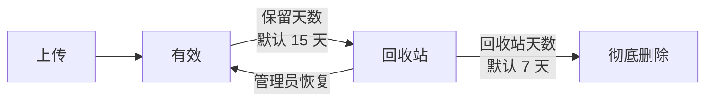

# 系统设置

在左侧菜单进入**管理 → 系统设置**。这里的修改**保存后立即生效**，无需重启服务。

## 单文件最大体积

限制单个文件的大小，默认 **500 MB**，可设置 1 ~ 102400 MB。

超出限制的文件会在**开始上传前**就被拒绝，不会占用服务器空间。

## 允许上传的文件类型

有两种模式：

- **允许所有文件类型**（默认）—— 不做任何限制。
- **只允许指定类型** —— 填写允许的扩展名，例如 `pdf,docx,xlsx,png,jpg`。

填写时格式很宽松：可以用逗号、分号、空格或顿号分隔，大小写不限，前面的点可写可不写。例如下面这些写法效果相同：

```
pdf,docx,xlsx
.PDF .Docx .XLSX
pdf、docx、xlsx
```

页面提供了几个常用预设（仅文档与图片、仅图片、压缩包与文档），点一下即可填入。

::: tip 留空 = 允许全部
把输入框清空，就恢复为允许所有类型。
:::

## 文件保留天数

文件上传后经过多少天自动删除（进入回收站），默认 **15 天**，可设置 1 ~ 3650 天。

修改后：

- **新上传**的文件按新天数计算到期时间。
- **已上传**的文件仍按原来的到期时间生效。

## 回收站保留天数

文件进入回收站后继续保留多少天，默认 **7 天**，可设置 0 ~ 365 天。

- 保留期内，管理员可以在[文件与回收站](./files)中恢复文件。
- 保留期结束后，文件会被**彻底删除**（磁盘文件与记录一并删除，不可恢复）。
- 设为 `0` 表示进入回收站后立即彻底删除。

## 分片大小

大文件分片上传时每片的大小，默认 **4 MB**，可设置 1 ~ 64 MB。

一般不需要调整。网络较差的场景可以调小，内网高速环境可以调大。

修改只影响**新的**上传任务，进行中的任务不受影响。

## 允许上传

总开关。关闭后所有用户都无法上传新文件，**已上传的文件不受影响**。

适合在维护、迁移或磁盘空间告急时临时关闭。

## 关于到期的完整流程



两个天数共同决定了文件在服务器上最多保留多久。默认配置下最长约 **22 天**。

## 下一步

- [文件与回收站](./files)
- [操作日志](./logs)
