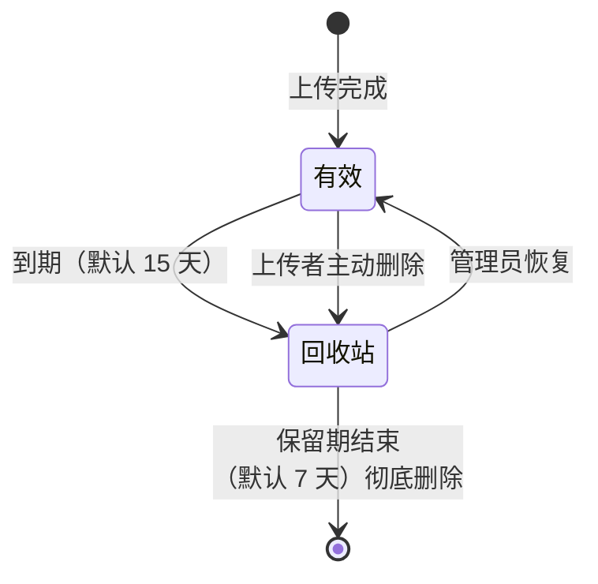

# 功能一览

## 账号与权限

系统有两种角色：**管理员**和**普通用户**。

| 能力 | 普通用户 | 管理员 |
| --- | :---: | :---: |
| 浏览、搜索全部文件 | ✅ | ✅ |
| 在线预览、下载任意文件 | ✅ | ✅ |
| 上传文件 | ✅ | ✅ |
| 重命名 / 删除 | 仅自己的文件 | 任意文件 |
| 查看回收站、恢复文件 | ❌ | ✅ |
| 用户管理 | ❌ | ✅ |
| 系统管理（上传策略 + 存储一致性检查） | ❌ | ✅ |

登录使用**工号 + 密码**。姓名只用于显示，可以重名；工号是唯一的，创建后不可修改。

## 每个成员一个目录

每位成员在首次创建账号时会自动获得一个独立目录：

```
users/
├── 1/          ← 成员 A 的目录
│   ├── 1.pdf
│   └── 2.docx
└── 2/          ← 成员 B 的目录
    └── 3.xlsx
```

- 上传的文件只会进入**自己的目录**。
- 只有上传者本人可以重命名或删除这些文件。
- 所有登录用户都能浏览、下载、预览这些文件。

## 文件自动清理

为了不让磁盘被无效文件堆满，文件有明确的生命周期：



- 上传后默认 **15 天**自动删除，文件会立即从所有人的列表中消失。
- 删除后会进入**回收站**，默认再保留 **7 天**，期间管理员可以恢复。
- 超过保留期后，文件会被彻底删除。
- 这两个天数都可以由管理员在后台调整。

::: tip 注意
文件一旦进入回收站，**连上传者本人都看不到**，只有管理员能看到并恢复。
:::

## 在线预览

以下类型可以直接在浏览器里打开，不需要下载：

| 类型 | 格式 |
| --- | --- |
| 文档 | `.docx` |
| 表格 | `.xlsx` |
| 演示 | `.pptx` |
| PDF | `.pdf` |
| 图片 | `png` `jpg` `jpeg` `gif` `webp` `bmp` |
| 文本 | `txt` `md` `csv` `log` `json` `xml` 及常见代码文件 |
| 音视频 | `mp4` `webm` `mp3` `wav` `m4a` 等 |

::: warning 旧版 Office 格式
`.doc`、`.xls`、`.ppt` 是旧版二进制格式，浏览器无法直接解析，只能下载后查看。用 Office 另存为 `.docx` / `.xlsx` / `.pptx` 后重新上传即可在线预览。
:::

## 大文件上传

- 文件会被切成若干分片并发上传，速度比单次上传更稳定。
- 传输中断、刷新页面、甚至服务重启后，都可以**接着传**，已经传完的分片不会重传。
- 不上传给其他人的文件也一样：上传完成后才能被其他人看到。

## 上传限制

管理员可以配置：

- **单文件最大体积** —— 默认 500 MB。
- **允许的文件类型** —— 默认允许全部。

超出限制的文件会在开始上传前就被拒绝，不会占用磁盘空间。
